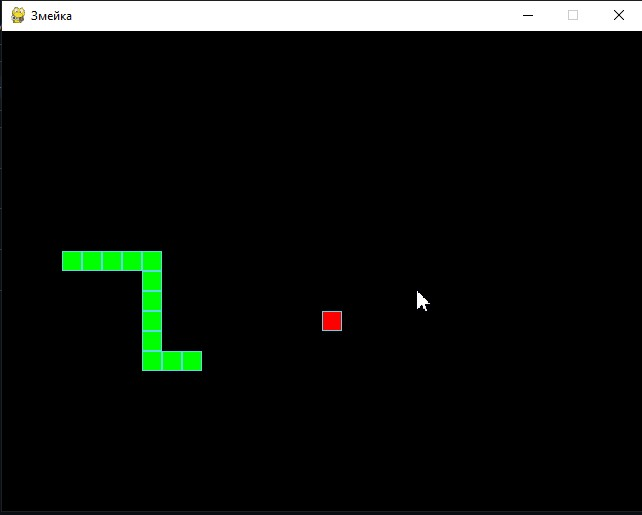

# Змейка

*Каждый разработчик хотя бы раз должен написать змейку!*  
**Народная мудрость 😉**

---


**Суть игры** заключается в том, что игрок управляет змейкой, которая движется по игровому полю, разделённому на клетки.

**Цель игры** — увеличивать длину змейки, «съедая» появляющиеся на экране яблоки (часто изображаемые в виде точек или других символов).




## Правила игры
- Змейка состоит из сегментов.
- Змейка движется в одном из четырёх направлений — вверх, вниз, влево или вправо. Игрок управляет направлением движения, но змейка не может остановиться или двигаться назад.
- Каждый раз, когда змейка съедает яблоко, она увеличивается в длину на один сегмент.
- В классической версии игры столкновение змейки с границей игрового поля приводит к проигрышу. Однако в этой вариации змейка может проходить сквозь стену и появляться с противоположной стороны поля.
- Если змейка столкнётся сама с собой — игра начинается с начала.

## Как запустить проект:

### 1. Клонировать репозиторий и перейти в него в командной строке:
```sh
git clone https://github.com/K-u-n-i-n/the_snake/
```
```sh
cd the_snake
```
### 2. В корневой директории проекта создайте виртуальное окружение:

- Для Windows:
```sh
python -m venv venv
```
- Для Linux/MacOS:
```sh
python3 -m venv venv
```
### 3. Активируйте виртуальное окружение, находясь в корневой директории:
- Для Windows:
```sh
source venv/Scripts/activate
```
- Для Linux/MacOS:
```sh
source venv/bin/activate
```

### 4. Обновите пакетный менеджер, находясь в корневой директории:
- Для Windows:
```sh
python -m pip install --upgrade pip
```
- Для Linux/MacOS:
```sh
python3 -m pip install --upgrade pip
```
### 5. Установите зависимости проекта командой, находясь в корневой директории:
```sh
pip install -r requirements.txt
```
### 6. Запустить проект:
- Для Windows:
```sh
python the_snake.py
```
- Для Linux/MacOS:
```sh
python3 the_snake.py
```